<div align="center">

<a href="https://sevagis.dpdns.org">
  
</a>

#  𝐒𝐄𝐕𝐀 · 𝐆𝐈𝐒

### *Spatial Evaluation & Vegetation Analytics*

> **SEVA.GIS:** Spatial Evaluation &amp; Vegetation Analytics. Free GeoAI farm monitor using live Sentinel-2 data.
> <br/>
> **Live App:** [sevagis.dpdns.org](https://sevagis.dpdns.org) &nbsp;|&nbsp; **Backup:** [virahitvin8.github.io/seva-gis/](https://virahitvin8.github.io/seva-gis/)

**See your farm the way a satellite does.**
<br/>
Free &nbsp;·&nbsp; Keyless &nbsp;·&nbsp; Open-Source &nbsp;·&nbsp; In-Browser GeoAI

<br/>

[](https://sevagis.dpdns.org)
[](https://virahitvin8.github.io/seva-gis/)
[](https://github.com/virahitvin8/seva-gis/issues)

<br/>

[](LICENSE)


</div>

---

<div align="center">

## ✨ Try it — no login needed to explore

> *Draw your farm boundary, watch real Sentinel-2 satellite data load instantly, and get plain-language advice about crop health, irrigation need and soil — all in your browser.*

### **→ [Open SEVA.GIS now at sevagis.dpdns.org](https://sevagis.dpdns.org) ←**

*Works on desktop · Android · Installs as a PWA (Add to Home screen)*

</div>

---

## 🎬 Full walkthrough with real satellite data

> Mitra, the in-app guide, walks a real farm near **Ludhiana, Punjab** — live Sentinel-2 imagery, NDVI crop health, month-by-month time-lapse from June → October 2026, and a full downloadable report.

<div align="center">

[](https://sevagis.dpdns.org)

*▲ Click the animation to open the live app &nbsp;|&nbsp; [▶ Watch as video (WebM · 147 KB)](https://github.com/virahitvin8/seva-gis/blob/main/docs/seva-gis-tour.webm)*

</div>

---

<div align="center">


</div>

---

## 🗺️ Where is what — guided quick tour

> First time? **Mitra** gives you a 60-second guided tour the moment you sign in. It highlights each part of the screen and explains it. You can skip, go back, or reopen it any time.

**Mitra's click-by-click tour:** menu → add farm → live map → NDVI indices → analysis lab → GeoAI studio → geo tools → report → sign out

<div align="center">

[](https://sevagis.dpdns.org)

*▲ Covers: menu · add farm · live map · indices with scales · analysis lab · GeoAI · geo tools · reports · sign out*

</div>

---

## 📖 Contents

[Why SEVA.GIS](#-why-sevagis) · [Features](#-features) · [Data sources](#-data-sources) · [Methodology & Architecture](#-methodology--architecture) · [Limitations](#-limitations) · [Author](#-author) · [Credits](#-credits)

---

## 🌱 Why SEVA.GIS

Most satellite tools are locked behind subscriptions or require GIS expertise. SEVA.GIS does the opposite:

- **Keyless.** No API keys, no subscription. Uses open Copernicus data.
- **Personal.** A new account starts empty — you add your own farm, your data stays in your browser.
- **Plain language.** Every number has a scale and a "Why?" line.
- **Cross-platform.** Desktop · Android · installable as a PWA.
- **Real data only.** No demo farms pre-loaded — every result is from actual Sentinel-2 imagery.

---

## 🛰️ Features

| Area | Capability |
|---|---|
| **Farm boundary** | Draw on map, walk with GPS, type corners, or upload GeoJSON · KML · GPX · WKT · CSV · zipped Shapefiles |
| **Imagery** | Newest cloud-filtered Sentinel-2 L2A scene (≤30% cloud, last 60 → 180 days), cloud-masked & clipped to boundary. Copernicus true-colour + Esri HR imagery to zoom 18 |
| **Spectral indices** | NDVI · NDMI · NDWI · NDRE · EVI · BSI — each with a verdict and plain-language advice |
| **Terrain** | Copernicus 30 m DEM: slope, aspect, hillshade, contours, TWI |
| **Time-lapse** | Month-by-month Sentinel-2 frames with Mitra captions — watch your crop change season to season |
| **GeoAI studio** | Sharpened true-colour + auto classification: k-means++ (unsupervised), minimum-distance & maximum-likelihood (supervised). GeoJSON export |
| **Nearby features** | OpenStreetMap Overpass: borewells, tube wells, hand pumps, lakes, ponds, streams, canals, power lines — distance rings, inside/outside marking, per-layer toggles |
| **Analysis lab** | True-colour · land cover · zones · change · weak-spot maps, each explained with vulnerability points |
| **Weather & soil** | Open-Meteo forecast + pest risk, SoilGrids soil properties |
| **Reports** | PDF (print to PDF) + one-file HTML with coordinate frame, north arrow, scale bar, legend — moveable in preview |
| **Languages** | English · Hindi · Telugu (Google Translate toggle beside the notification bell) |
| **Geo tools** | WKT reader, offset & buffer, each with in-app how-to guides |
| **Accounts** | Local, in-browser — data stays on your device |

---

## 📡 Data sources

| Data | Provider |
|---|---|
| Sentinel-2 L2A · Copernicus DEM | [Microsoft Planetary Computer](https://planetarycomputer.microsoft.com/) |
| Weather & climate | [Open-Meteo](https://open-meteo.com/) |
| Soil | [SoilGrids — ISRIC](https://soilgrids.org/) |
| Imagery & base maps | [Esri](https://www.esri.com/en-us/arcgis/products/arcgis-online/overview) |
| 3D terrain | [AWS Terrain Tiles](https://registry.opendata.aws/terrain-tiles/) |
| Nearby features | [OpenStreetMap / Overpass API](https://overpass-api.de/) |

---

## 🔬 Methodology & Architecture

> *A keyless in-browser geospatial pipeline transforming raw Sentinel-2 L2A multispectral bands and Copernicus DEM radar topography into actionable agronomic intelligence.*

<div align="center">

[](docs/seva-gis-architecture.tldr)
&nbsp;
[](scripts/architecture_diagram.py)
&nbsp;
[](https://gitdiagram.com/virahitvin8/seva-gis?utm_source=readme&utm_medium=badge)

<br/><br/>

<a href="docs/architecture-diagram.png" target="_blank">
  
</a>

<br/>

*▲ SEVA·GIS system architecture designed in [tldraw](https://github.com/tldraw/tldraw) infinite whiteboard canvas style & modeled via [mingrammer/diagrams](https://github.com/mingrammer/diagrams) Diagram-as-Code. Download [`docs/seva-gis-architecture.tldr`](docs/seva-gis-architecture.tldr) to open and edit directly on [tldraw.com](https://www.tldraw.com).*

</div>

<br/>

<details>
<summary>🐍 <b>View Diagram-as-Code Implementation (mingrammer/diagrams)</b></summary>

```python
"""
SEVA·GIS — System Architecture Diagram as Code
Powered by mingrammer/diagrams (https://github.com/mingrammer/diagrams)
"""
from diagrams import Diagram, Cluster, Edge
from diagrams.programming.framework import React
from diagrams.onprem.client import User, Client
from diagrams.generic.storage import Storage
from diagrams.programming.language import TypeScript

with Diagram("SEVA·GIS System Architecture", show=False, direction="TB"):
    with Cluster("1. App Workspace & Client Core"):
        farmer = User("Field Farmer / User\n[Browser / Mobile PWA]")
        workspace = React("Workspace Shell\n[src/App.tsx]")
        boundary = TypeScript("Boundary Geometry\n[src/AddFarm.tsx]")
        auth = Storage("Local Device Vault\n[src/Auth.tsx & db.ts]")
        mitra = Client("Mitra 60s Tour\n[src/Mitra.tsx]")

        farmer >> Edge(label="opens workspace") >> workspace
        workspace >> Edge(label="traces perimeter") >> boundary
        boundary >> Edge(label="persists offline") >> auth
        auth >> Edge(label="triggers tour") >> mitra

    with Cluster("2. Keyless Open Data Providers (REST / STAC / COG)"):
        sentinel = Storage("Sentinel-2 L2A BOA\n[Planetary Computer STAC]")
        dem = Storage("Copernicus DEM (GLO-30)\n[AWS Open Data]")
        meteo = Storage("Open-Meteo Agro API\n[open-meteo.com]")
        soil = Storage("SoilGrids ISRIC 250m\n[ISRIC WCS]")
        osm = Storage("OSM Overpass\n[Overpass API]")

    with Cluster("3. Compute Core (Client-Side)"):
        pipeline = TypeScript("Satellite Pipeline\n[src/seva.ts]")
        raster = TypeScript("Raster Math Engine\n[src/raster.ts]")
        indices = TypeScript("Spectral Indices\n[src/indicators.ts]")
        hydro = TypeScript("Terrain Hydrology\n[src/hydro.ts]")
        compositor = TypeScript("Map Compositor\n[src/gee.ts]")
        proximity = TypeScript("Infrastructure Proximity\n[src/nearby.ts]")

        sentinel >> Edge(label="10m bands") >> pipeline
        dem >> Edge(label="30m elevation") >> hydro
        pipeline >> Edge(label="GeoTIFF tiles") >> raster
        raster >> Edge(label="band math") >> indices
        pipeline >> Edge(label="slope & aspect") >> hydro
        raster >> Edge(label="composites") >> compositor

    with Cluster("4. GeoAI Studio & Farm Intelligence"):
        geoai = React("GeoAI Segmentation\n[src/Studio.tsx]")
        intel = React("Intelligence Lab\n[src/Intelligence.tsx]")
        timelapse = React("Seasonal Time-Lapse\n[src/Timelapse.tsx]")
        advisory = React("Agro Advisory\n[src/AgroPanel.tsx]")
        water_diag = React("Water & Soil Diagnostics\n[src/WaterPanel.tsx]")
        nearby_ovl = React("Nearby Overlays\n[src/NearbyLayer.tsx]")

        meteo >> Edge(label="7d forecast") >> advisory
        soil >> Edge(label="soil depth") >> water_diag
        osm >> Edge(label="borewells & canals") >> nearby_ovl
        indices >> Edge(label="NDVI clusters") >> geoai
        indices >> Edge(label="anomalies") >> intel
        indices >> Edge(label="temporal series") >> timelapse
        hydro >> Edge(label="drainage & TWI") >> water_diag
        proximity >> Edge(label="distance rings") >> nearby_ovl

    with Cluster("5. Cartographic Deliverables & Field Tools"):
        map_canvas = React("Interactive Map Canvas\n[src/IndicatorMap.tsx]")
        report = TypeScript("Branded PDF Dossier\n[src/report.ts]")
        geotools = TypeScript("Geospatial Tools\n[src/GeoTools.tsx]")
        tour_engine = React("Field Operator Tour\n[Mitra Tour Engine]")

        compositor >> Edge(label="GPU WebGL tiles") >> map_canvas
        indices >> Edge(label="NDVI certificate") >> report
        advisory >> Edge(label="agronomic verdict") >> report
        proximity >> Edge(label="WGS84 toolkit") >> geotools
        mitra >> Edge(label="onboarding") >> tour_engine
```

*Executable script: [`scripts/architecture_diagram.py`](scripts/architecture_diagram.py)*

</details>

<br/>

### 🗺️ System Architecture Flowchart

```mermaid
%% Generated by https://gitdiagram.com/virahitvin8/seva-gis
flowchart TD

subgraph group_entry["App and accounts"]
  node_app["Farm workspace<br/>[App.tsx]"]
  node_farm_entry["Boundary editor<br/>[AddFarm.tsx]"]
  node_accounts["Local accounts<br/>[Auth.tsx]"]
end

subgraph group_analysis["Farm analysis"]
  node_satellite["Satellite analysis<br/>[seva.ts]"]
  node_indicators["Spectral indicators<br/>[indicators.ts]"]
  node_gee["Analysis maps<br/>[gee.ts]"]
  node_indicator_map["Indicator maps<br/>[IndicatorMap.tsx]"]
  node_terrain_water["Terrain and drainage<br/>[hydro.ts]"]
end

subgraph group_insights["Insights and tools"]
  node_agro["Weather and soil<br/>[agro.ts]"]
  node_agro_panel["Farm advice<br/>[AgroPanel.tsx]"]
  node_water_panel["Water and soil panel<br/>[WaterPanel.tsx]"]
  node_intelligence["Analysis lab<br/>[Intelligence.tsx]"]
  node_studio["GeoAI studio<br/>[Studio.tsx]"]
  node_timelapse["Seasonal time-lapse<br/>[Timelapse.tsx]"]
  node_nearby["Nearby features<br/>[NearbyLayer.tsx]"]
  node_geo_tools["Geospatial tools<br/>[GeoTools.tsx]"]
  node_report_panel["Report interface<br/>[ReportPanel.tsx]"]
  node_report_engine["Report generation<br/>[report.ts]"]
end

subgraph group_foundation["Data and geospatial core"]
  node_account_store[("Browser account store<br/>[db.ts]")]
  node_raster["Raster operations<br/>[raster.ts]"]
  node_nearby_data["Nearby data query<br/>[nearby.ts]"]
  node_farm_geometry["Farm geometry<br/>[geo.ts]"]
end

node_farmer(("Farm user"))
node_sentinel[("Sentinel-2 data")]
node_copernicus_dem[("Copernicus DEM")]
node_open_meteo["Open-Meteo"]
node_soilgrids["SoilGrids"]
node_overpass["OSM Overpass"]

node_farmer -->|"uses"| node_app
node_app -->|"opens boundary editor"| node_farm_entry
node_app -->|"uses account"| node_accounts
node_accounts -->|"authenticates and opens"| node_account_store
node_app -->|"analyzes farm"| node_satellite
node_farm_entry -->|"uses geometry"| node_farm_geometry
node_satellite -->|"parses raster"| node_raster
node_satellite -->|"computes indicators"| node_indicators
node_satellite -->|"uses terrain analysis"| node_terrain_water
node_gee -->|"loads scenes"| node_satellite
node_gee -->|"renders layers"| node_indicators
node_indicators -->|"uses raster operations"| node_raster
node_app -->|"shows map"| node_indicator_map
node_indicator_map -->|"loads imagery and DEM"| node_satellite
node_indicator_map -->|"renders layers"| node_indicators
node_app -->|"shows farm advice"| node_agro_panel
node_app -->|"shows water insights"| node_water_panel
node_water_panel -->|"fetches weather and soil"| node_agro
node_water_panel -->|"loads terrain data"| node_satellite
node_app -->|"opens analysis lab"| node_intelligence
node_intelligence -->|"requests history and comparisons"| node_gee
node_intelligence -->|"offers GeoAI studio"| node_studio
node_intelligence -->|"offers time-lapse"| node_timelapse
node_indicator_map -->|"shows nearby layers"| node_nearby
node_nearby -->|"queries nearby data"| node_nearby_data
node_app -->|"opens geospatial tools"| node_geo_tools
node_app -->|"shows reports"| node_report_panel
node_satellite -.->|"fetches imagery"| node_sentinel
node_satellite -.->|"fetches elevation"| node_copernicus_dem
node_agro -->|"fetches forecast"| node_open_meteo
node_agro -->|"fetches soil properties"| node_soilgrids
node_nearby_data -.->|"queries map features"| node_overpass

click node_app "https://github.com/virahitvin8/seva-gis/blob/main/src/App.tsx"
click node_farm_entry "https://github.com/virahitvin8/seva-gis/blob/main/src/AddFarm.tsx"
click node_accounts "https://github.com/virahitvin8/seva-gis/blob/main/src/Auth.tsx"
click node_account_store "https://github.com/virahitvin8/seva-gis/blob/main/src/lib/db.ts"
click node_satellite "https://github.com/virahitvin8/seva-gis/blob/main/src/lib/seva.ts"
click node_raster "https://github.com/virahitvin8/seva-gis/blob/main/src/lib/raster.ts"
click node_indicators "https://github.com/virahitvin8/seva-gis/blob/main/src/lib/indicators.ts"
click node_gee "https://github.com/virahitvin8/seva-gis/blob/main/src/lib/gee.ts"
click node_indicator_map "https://github.com/virahitvin8/seva-gis/blob/main/src/IndicatorMap.tsx"
click node_terrain_water "https://github.com/virahitvin8/seva-gis/blob/main/src/lib/hydro.ts"
click node_agro "https://github.com/virahitvin8/seva-gis/blob/main/src/lib/agro.ts"
click node_agro_panel "https://github.com/virahitvin8/seva-gis/blob/main/src/AgroPanel.tsx"
click node_water_panel "https://github.com/virahitvin8/seva-gis/blob/main/src/WaterPanel.tsx"
click node_intelligence "https://github.com/virahitvin8/seva-gis/blob/main/src/Intelligence.tsx"
click node_studio "https://github.com/virahitvin8/seva-gis/blob/main/src/Studio.tsx"
click node_timelapse "https://github.com/virahitvin8/seva-gis/blob/main/src/Timelapse.tsx"
click node_nearby "https://github.com/virahitvin8/seva-gis/blob/main/src/NearbyLayer.tsx"
click node_nearby_data "https://github.com/virahitvin8/seva-gis/blob/main/src/lib/nearby.ts"
click node_geo_tools "https://github.com/virahitvin8/seva-gis/blob/main/src/GeoTools.tsx"
click node_report_panel "https://github.com/virahitvin8/seva-gis/blob/main/src/ReportPanel.tsx"
click node_report_engine "https://github.com/virahitvin8/seva-gis/blob/main/src/report.ts"
click node_farm_geometry "https://github.com/virahitvin8/seva-gis/blob/main/src/lib/geo.ts"

classDef toneNeutral fill:#f8fafc,stroke:#334155,stroke-width:1.5px,color:#0f172a
classDef toneBlue fill:#dbeafe,stroke:#2563eb,stroke-width:1.5px,color:#172554
classDef toneAmber fill:#fef3c7,stroke:#d97706,stroke-width:1.5px,color:#78350f
classDef toneMint fill:#dcfce7,stroke:#16a34a,stroke-width:1.5px,color:#14532d
classDef toneRose fill:#ffe4e6,stroke:#e11d48,stroke-width:1.5px,color:#881337
classDef toneIndigo fill:#e0e7ff,stroke:#4f46e5,stroke-width:1.5px,color:#312e81
classDef toneTeal fill:#ccfbf1,stroke:#0f766e,stroke-width:1.5px,color:#134e4a
class node_app,node_farm_entry,node_accounts,node_farmer toneBlue
class node_satellite,node_indicators,node_gee,node_indicator_map,node_terrain_water,node_sentinel,node_copernicus_dem toneAmber
class node_agro,node_agro_panel,node_water_panel,node_intelligence,node_studio,node_timelapse,node_nearby,node_geo_tools,node_report_panel,node_report_engine toneMint
class node_account_store,node_raster,node_nearby_data,node_farm_geometry toneRose
class node_open_meteo,node_soilgrids,node_overpass toneIndigo
```



<br/>

### 🛰️ Processing Pipeline & Signal Rules

1. Find the newest Sentinel-2 scene over the farm (last 60 days, then 180) with under 30% cloud.
2. Mask cloud, shadow and bad pixels using the scene classification layer.
3. Compute spectral indices inside the boundary.
4. Derive slope, aspect and drainage from the DEM.
5. Draw maps with a legend for every colour scale.
6. Convert numbers to advice with the reason shown next to it.

| Signal | Rule |
|---|---|
| NDVI below 0.3 | Pixel counted as stressed |
| >20% stressed pixels, or mean NDVI < 0.4 | Farm flagged for attention |
| NDMI below 0.1 | Leaves look dry → used in irrigation advice |
| 15 mm or more rain in 7 days | Advice becomes "hold, rain due" |
| Slope above 15% | Challenging for construction |

---

## ⚠️ Limitations

- A satellite shows *where* a crop is weaker, not *why*.
- Pest and moisture scores are rules of thumb, not forecasts.
- Sentinel-2 resolution is 10 m — very small farms have few pixels.
- Accounts are local to one browser. No sync or password reset.
- Construction notes are not an engineering survey.

---

## 👨‍💻 Author

<div align="center">

**N. Akshit Vinay**

*Idea, design and Vibe coded 💖 — for everyone who loves the land and wants to see it grow.*

<br/>

[](mailto:akshitvinay4636@gmail.com)
[](https://www.linkedin.com/in/neelam-akshit-vinay-b18554322)
[](https://github.com/virahitvin8)

Released under the [MIT License](LICENSE).

</div>

---

## 🙏 Credits

Data providers, libraries, methods and hosting are fully listed in [docs/CREDITS.md](docs/CREDITS.md).

---

<div align="center">

*Powered by open data from ESA Copernicus*

**[⭐ Star this repo](https://github.com/virahitvin8/seva-gis/stargazers) if SEVA.GIS helped you or someone you know**

</div>
