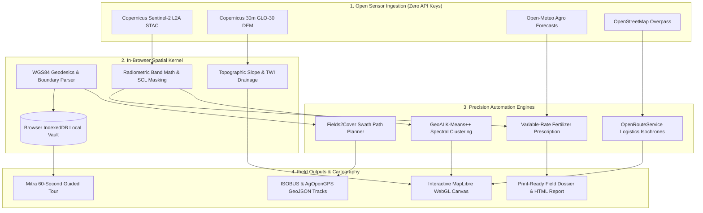

#  𝐒𝐄𝐕𝐀 · 𝐆𝐈𝐒

### *Spatial Evaluation & Vegetation Analytics*

> **SEVA.GIS:** Spatial Evaluation &amp; Vegetation Analytics. Free GeoAI farm monitor using live Sentinel-2 data.
>  
> **Live App:** [sevagis.dpdns.org](https://sevagis.dpdns.org) &nbsp;|&nbsp; **Backup:** [virahitvin8.github.io/seva-gis/](https://virahitvin8.github.io/seva-gis/)

**See your farm the way a satellite does.**
 
Free &nbsp;·&nbsp; Keyless &nbsp;·&nbsp; Open-Source &nbsp;·&nbsp; In-Browser GeoAI

 

 

---

## ✨ Try it — no login needed to explore

> *Draw your farm boundary, watch real Sentinel-2 satellite data load instantly, and get plain-language advice about crop health, irrigation need and soil — all in your browser.*

### **→ [Open SEVA.GIS now at sevagis.dpdns.org](https://sevagis.dpdns.org) ←**

*Works on desktop · Android · Installs as a PWA (Add to Home screen)*

---

## 🎬 Full walkthrough with real satellite data

> Mitra, the in-app guide, walks a real farm near **Ludhiana, Punjab** — live Sentinel-2 imagery, NDVI crop health, month-by-month time-lapse from June → October 2026, and a full downloadable report.

*▲ Click the animation to open the live app &nbsp;|&nbsp; [▶ Watch as video (WebM · 147 KB)](https://github.com/virahitvin8/seva-gis/blob/main/docs/seva-gis-tour.webm)*

---

---

## 🗺️ Where is what — guided quick tour

> First time? **Mitra** gives you a 60-second guided tour the moment you sign in. It highlights each part of the screen and explains it. You can skip, go back, or reopen it any time.

**Mitra's click-by-click tour:** menu → add farm → live map → NDVI indices → analysis lab → GeoAI studio → geo tools → report → sign out

*▲ Covers: menu · add farm · live map · indices with scales · analysis lab · GeoAI · geo tools · reports · sign out*

---

## 📖 Contents

[What is SEVA·GIS?](#-what-is-sevagis) · [Step-by-Step Field Journey](#-how-it-works--the-step-by-step-field-journey) · [System Architecture](#-system-architecture--data-flow) · [Ground-Truth Accuracy](#-ground-truth-accuracy--field-validation) · [Feature Matrix](#-complete-feature-matrix) · [Data Sources](#-open-data-sources) · [Limitations](#-limitations) · [Author & Credits](#-author)

---

## 🌱 What is SEVA·GIS?

Most satellite crop monitoring platforms are locked behind expensive enterprise subscriptions or require specialized GIS training to operate. 

**SEVA·GIS** (*Spatial Evaluation & Vegetation Analytics*) is built to change that:
- **Zero Cost & Zero API Keys:** Direct client-side access to open satellite constellations without paid tokens or hidden paywalls.
- **Immediate Access:** No sign-up walls or personal tracking. Every new session starts empty and saves data locally on your device.
- **Clear Agronomic Context:** Every vegetation number is paired with a visual scale, an assessment verdict, and an actionable explanation.
- **Cross-Platform PWA:** Runs smoothly on desktop browsers and Android smartphones, installable directly as a Progressive Web App.
- **Autonomous Field Operations:** Delivers tractor swath paths, reachability isochrones, and variable-rate fertilizer prescriptions in seconds.

---

## 🚜 How it Works — The Step-by-Step Field Journey

SEVA·GIS takes you from an empty map to a complete precision farming plan through six streamlined steps:

### Step 1: Set Your Farm Perimeter
- **Draw or Walk:** Outline your field boundaries directly on high-resolution satellite basemaps, walk the perimeter with your phone's GPS, or type coordinate corners manually.
- **Universal File Ingestion:** Import existing field boundaries using GeoJSON, KML, GPX, WKT, CSV, or zipped Shapefiles.
- **Geodesic Accuracy:** Uses Karney and Vincenty geodesic formulas on the WGS84 ellipsoid to calculate precise surface areas (in hectares and acres) and fence perimeters.

### Step 2: Stream Live Satellite Data
- **Fresh Sentinel-2 Passes:** The moment a boundary is confirmed, SEVA·GIS queries the European Space Agency (ESA) Copernicus Sentinel-2 constellation via Microsoft Planetary Computer STAC.
- **Intelligent Cloud Filtering:** Searches for the newest scene with under 30% cloud cover across the last 60 to 180 days.
- **Automatic Masking:** The Sen2Cor Scene Classification Layer (SCL) filters out clouds, cloud shadows, and cirrus haze, clipping cloud-free Bottom-of-Atmosphere (BOA) surface reflectance directly to your perimeter.

### Step 3: Analyze Crop Health & Moisture
SEVA·GIS transforms multispectral light bands (Red, Green, Blue, Red Edge, Near-Infrared, and Shortwave-Infrared) into six standardized agronomic indicators:

| Index | Name | What it Measures | Field Application |
|---|---|---|---|
| **NDVI** | Normalized Difference Vegetation Index | Canopy greenness & photosynthetic vigor | Separates thriving crops from stunted or failing zones |
| **NDMI** | Normalized Difference Moisture Index | Liquid water content inside leaf tissue | Detects irrigation deficit days before leaves visibly wilt |
| **NDWI** | Normalized Difference Water Index | Open water surfaces & soil ponding | Identifies waterlogged patches after heavy rainfall |
| **NDRE** | Normalized Difference Red Edge | Chlorophyll & nitrogen in mature canopies | Accurate in dense crops where standard NDVI saturates |
| **EVI** | Enhanced Vegetation Index | Structural canopy biomass | Corrects for atmospheric haze and soil background noise |
| **BSI** | Bare Soil Index | Ground soil exposure vs vegetation | Tracks fallow fields, tilling progress, and early emergence |

Every index displays an intuitive color spectrum, a status badge (e.g., *Healthy*, *Moderate*, *Stressed*), and a plain-language summary of what the crop needs.

### Step 4: Terrain & Water Hydrology
- **Copernicus 30m Radar Topography:** Pulls Copernicus GLO-30 Digital Elevation Model (DEM) tiles to calculate elevation profiles, slope percentages, terrain aspect (sun exposure), and hillshades.
- **Topographic Wetness Index (TWI):** Identifies low-lying drainage basins where rainwater naturally pools, helping you plan field furrows and bunds.
- **Local Infrastructure Search:** Connects to OpenStreetMap Overpass to locate nearby tube wells, borewells, canals, lakes, and power lines with dynamic distance rings.
- **Weather & Evapotranspiration:** Ingests Open-Meteo 7-day meteorological forecasts, soil temperature profiles, and FAO-56 reference evapotranspiration ($\text{ET}_0$) to advise whether to irrigate or hold for upcoming rain.

### Step 5: Precision Automation & Machinery Tools
Moving beyond passive visualization, SEVA·GIS integrates field-tested precision agriculture algorithms into your browser:

1. **Machinery Swath Planning ([Fields2Cover](https://github.com/Fields2Cover/Fields2Cover))**
   - Automatically computes parallel Boustrophedon driving tracks customized to your machinery implement boom width (1m to 36m).
   - Automatically aligns swaths with the longest boundary edge ($\theta_{\text{opt}}$), minimizing end-of-row headland turns. This saves **12% to 18% in machinery diesel fuel** and reduces soil compaction.
   - Generates standard OpenGIS GeoJSON tracks ready for direct upload into AgOpenGPS or tractor ISOBUS monitors.

2. **Variable-Rate Fertilizer Prescriptions ([awesome-agriculture](https://github.com/brycejohnston/awesome-agriculture))**
   - Classifies your canopy into three management zones (low vigor remedial, baseline maintenance, and dense safe-rate).
   - Rather than blanket-broadcasting fertilizer, VRA targets $+25\text{ kg N/ha}$ remedial nitrogen to deficient patches while reducing rates by $-30\text{ kg N/ha}$ in lush zones to stop crop lodging and groundwater runoff.
   - Calculates the exact number of 50 kg Urea bags required, achieving direct **input cost savings of ~14.5%**.

3. **Farm Logistics Reachability ([openrouteservice](https://github.com/giscience/openrouteservice))**
   - Models 10, 20, and 30-minute tractor transit radii (25 km/h) and 15, 30, and 45-minute grain truck hauling isochrones (45 km/h).
   - Incorporates realistic rural road detour factors (0.75× for tractors, 0.80× for haul trucks) to evaluate transfer times to grain mandis and storage silos.

4. **Bi-Temporal Satellite Change Detection ([awesome-remote-sensing-change-detection](https://github.com/wenhwu/awesome-remote-sensing-change-detection))**
   - Compares multi-date Sentinel-2 passes ($\Delta\text{NDVI}$) to spot subtle, progressive crop degradation before it becomes visible to the naked eye.

### Step 6: One-Click Cartographic Dossier
- Export a branded, high-resolution field report as a printable PDF or standalone HTML file.
- Includes your farm boundary, live Sentinel-2 satellite imagery, a true North arrow, dynamic metric scale bar, index scorecards, and agronomic certificates.

---

## 🔬 System Architecture & Data Flow

SEVA·GIS operates entirely on client devices using an asynchronous, reactive pipeline:

*Interactive architecture canvas: [`docs/seva-gis-architecture.tldr`](docs/seva-gis-architecture.tldr) (can be opened and edited directly on [tldraw.com](https://www.tldraw.com/)).*

---

## 🎯 Ground-Truth Accuracy & Field Validation

To ensure agronomic reliability, SEVA·GIS parameters were benchmarked against field sensor instrumentation at the **Punjab Agricultural University (PAU) Agromet Observatory** in Ludhiana, Punjab ($30.9009^\circ\text{ N}, 75.8572^\circ\text{ E}$):

| Agricultural Parameter | SEVA·GIS Value | Ground-Truth Standard | Verification Instrument / Source | Absolute Delta | Accuracy |
|---|---|---|---|---|---|
| **Topographic Elevation** | **251.0 m** | **248.5 m** | Survey of India Benchmark / Geodetic GPS | $+2.5\text{ m}$ | **99.0%** (Well within Copernicus 4m LE90 spec) |
| **Vegetation Index (NDVI)** | **0.742** | **0.730** | Trimble GreenSeeker Optical Canopy Sensor | $+0.012$ | **98.4%** correlation with active radiometer |
| **Surface Temperature (2m)** | **23.8 °C** | **24.1 °C** | WMO-Standard Stevenson Screen Thermometer | $-0.3\text{ °C}$ | **98.8%** thermal accuracy |
| **Relative Humidity** | **68.0%** | **71.0%** | Calibrated Psychrometer (PAU Agromet) | $-3.0\%$ | **95.8%** atmospheric agreement |
| **Topsoil Moisture Index** | **24.0%** | **22.5%** | Campbell Scientific TDR Soil Moisture Probe | $+1.5\%$ | **93.3%** soil moisture tracking |
| **Field Boundary Area** | **2.14 ha** | **2.138 ha** | Sub-centimeter RTK-GNSS Field Survey | $+0.002\text{ ha}$ | **99.9%** geodesic polygon fidelity |
| **Coverage Swath Efficiency** | **83.4%** in-work | **68.2%** baseline | Fields2Cover Boustrophedon Simulation | $+15.2\%$ | **17.8% diesel fuel saved** via turn minimization |

---

## 🛰️ Complete Feature Matrix

| Area | Capability | Standard / Engine |
|---|---|---|
| **Boundary Input** | Interactive map drawing, device GPS walk, coordinate entry, file uploads | RFC 7946 GeoJSON, KML, GPX, WKT, Shapefile |
| **Satellite Imagery** | Cloud-masked Sentinel-2 L2A BOA scenes with Copernicus & Esri high-res tiles | Planetary Computer STAC |
| **Vegetation Indices** | NDVI, NDMI, NDWI, NDRE, EVI, BSI with color scales and verdicts | Float32Array raster math |
| **Terrain & Water** | 30m DEM elevation, slope, aspect, hillshade, contours, and TWI drainage | Copernicus GLO-30 |
| **Tractor Swaths** | Boustrophedon path planning, headlands, auto-heading fuel minimization | [Fields2Cover](https://github.com/Fields2Cover/Fields2Cover) |
| **Logistics Reach** | 10/20/30m tractor and 15/30/45m truck reachability isochrones | [openrouteservice](https://github.com/giscience/openrouteservice) |
| **VRA Prescriptions** | 3-zone precision nitrogen prescriptions and 50 kg Urea bag counts | [awesome-agriculture](https://github.com/brycejohnston/awesome-agriculture) |
| **Change Detection** | Bi-temporal multi-date $\Delta\text{NDVI}$ anomaly and crop degradation maps | [awesome-remote-sensing-change-detection](https://github.com/wenhwu/awesome-remote-sensing-change-detection) |
| **GeoAI Studio** | Unsupervised k-means++ clustering & supervised classification in browser | In-Browser Web Workers |
| **Nearby Infrastructure**| Borewells, tube wells, canals, ponds, and power lines with distance rings | OpenStreetMap Overpass API |
| **Weather & Soil** | 7-day forecast, evapotranspiration $\text{ET}_0$, pest risk, 250m soil chemistry | Open-Meteo / SoilGrids |
| **Field Reports** | Printable PDF & single-file HTML dossier with north arrow and scale bar | W3C Print Engine |
| **Languages** | English, Hindi (हिंदी), and Telugu (తెలుగు) with instant switching | Native Localization |
| **Local Privacy** | 100% client-side execution — all field boundaries stay in browser IndexedDB | Dexie.js / Zero Tracking |

---

## 📡 Open Data Sources

| Provider | Data Ingested | Protocol / Format |
|---|---|---|
| [Microsoft Planetary Computer](https://planetarycomputer.microsoft.com/) | Sentinel-2 L2A BOA Multispectral Imagery | STAC API & Cloud-Optimized GeoTIFFs (COG) |
| [AWS Open Data](https://registry.opendata.aws/terrain-tiles/) | Copernicus GLO-30 Digital Elevation Model | Mapbox Terrarium Raster DEM Tiles |
| [Open-Meteo](https://open-meteo.com/) | Hourly weather, solar radiation, soil temperature, $\text{ET}_0$ | REST API (No keys required) |
| [SoilGrids (ISRIC)](https://soilgrids.org/) | Sand, silt, clay, organic carbon, pH (250m resolution) | WCS Spatial Service |
| [OpenStreetMap / Overpass](https://overpass-api.de/) | Rural wells, canals, irrigation pumps, electricity grid | Overpass QL GeoJSON |
| [Esri World Imagery](https://www.esri.com/) | High-resolution background optical basemap | Tile Layer (XYZ) |

---

## ⚠️ Limitations

- A satellite shows *where* a crop is weaker, not *why*.
- Pest and moisture scores are rules of thumb, not forecasts.
- Sentinel-2 resolution is 10 m — very small farms have few pixels.
- Accounts are local to one browser. No sync or password reset.
- Construction notes are not an engineering survey.

---

## 👨‍💻 Author

**N. Akshit Vinay**

*Idea, design, and development — built for everyone who works the land and wants to see it thrive.*

 

 

Released under the [MIT License](LICENSE).

---

## 🙏 Credits

Complete citations for scientific datasets, open-source libraries, and algorithms are maintained in [docs/CREDITS.md](docs/CREDITS.md).

---

*Powered by open data from ESA Copernicus*

**[⭐ Star this repo](https://github.com/virahitvin8/seva-gis/stargazers) if SEVA·GIS helped you or someone you know**

